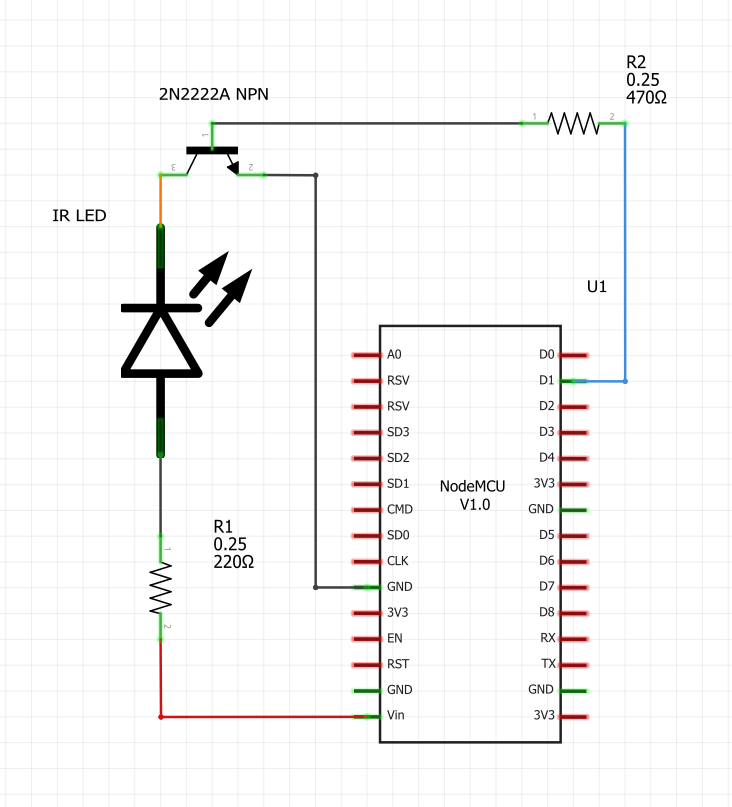

# ESP8266 Alexa to IR controller (transmitter)
This section of the repository demonstrates how to use an ESP-8266 to recieve Alexa commands and transmit corresponding IR commands. Specifically it demonstrates controlling a radiant heater that does not come with any documentation of the IR signals sent.  The NodeMCU Arduino code is available in the [code/alexa_ir_heater_controller](./code/alexa_ir_heater_controller/) folder.

### The IR codes
I obtained the IR codes by pushing each button on the remote and capturing it with the IR reciever set-up described in the [ir_receiver](../ir_receiver/) folder of this repository. The codes I captured can be seen in the [heater_remote_IR_codes](../ir_receiver/heater_remote_IR_codes_v2.txt) file in that folder.  In the Arduino NodeMCU code I used the hexidecimal representation of the IR tramsmissions.

### In order to make one of these you will need this hardware:
* [NodeMCU v1.0 ESP8266 development board](https://www.amazon.com/HiLetgo-Internet-Development-Wireless-Micropython/dp/B010O1G1ESS) or other ESP8266 development board such as the [Adafruit HUZZAH ESP8266 Breakout](https://www.adafruit.com/product/2471) or [SparkFun ESP8266 Thing](https://www.sparkfun.com/products/13231)
* Small signal transistor such as the 2N2222 or 555 IC to drive the LED
  * Demonstrating how to use a 555 timer IC instead of a small signal transistor is beyond the scope of this repository.  However to do so you use the 555 as shown in [this diagram](../assets/555_timer_as_buffer_to_drive_led.png).  The diagram shows a configuration that puts the 555 into buffer mode.  This is a subset of the Bistable Mode. You don't see it described much but it is a very viable use of a 555 IC. The buffer would be between NodeMCU pin and the LED in order to provide enough current to the LED without much load on the NodeMCU pin. Thus it provides the same function as the discrete transistor I show in the photos and breadboard image. There are other 555 diagrams in the [assets](../assets/) folder that may also be helpful.
* 220 Ohm and 470 Ohm resistors
* IR LED

### Alexa to IR tranmitter circuit:

* Link to the [Fritzing file](../assets/ESP8266_Alexa_IR_controller_w_transistor_2.fzz) of the breadboard circuit

### In order to make one of these you will need to install these Arduino libraries
* fauxmoESP  2.4.3 This rev is the last rev that simulated a Wemo smart plug.  Later 3.x versions simulate a Philips lightbulb.  The code in this repo will not work with 3.x and latter since this code creates three simulated Wemo smart plugs.  Since they can recieve on On and Off commands from Alexa there are a total of six commands we can use.  I have tried adding a 4th Wemo device in the code for additional commands but it appears that Alexa limits the number of Wemo plugs from a single IP address to three.  An improved version of this code would use the newest version of the fauxmo library since it simulates a Philips light providing not only On and Off but 100 levels of brightness.  That would allow you to use 102 commands to the simulated device, a vast improvement.  But I jsut need six so the code in this repo is sufficient for my use.
  * If you are using a development board like the NodeMCU v1.0 that contains a ESP8266 you will need to also install the ESP8266WiFi library
  * If you are using a development board like the NodeMCU v0.9 that contains a ESP32 you will need to install the WIFI library instead 
* IRremoteESP8266.h
* IRsend.h

When the code is downloaded to the NodeMCU and run it will create three devices that can be discovered by Alexa
* Heater device 1
* Heater device 2
* Heater device 3

To use these devices after adding them through Alexa device discovery, create Alexa routines the use the three devices On/Off states to issue IR commands that can be recieved by the heater
* [Heater control - Alexa and resulting IR commands from the ESP8266](https://docs.google.com/spreadsheets/d/1thoHuIrcbselhGR-zq0jwYt2loby5acfT-mOes6eoRw/edit?usp=sharing) mapping
* [Alexa heater routines](https://1drv.ms/w/s!AkhQRfMv5GmDhSj3fwgvKryUF9b4?e=UReHWI) to make the controller do what you want with the 6 total device states

### See the controller in action:

")

### Image of the completed controller

